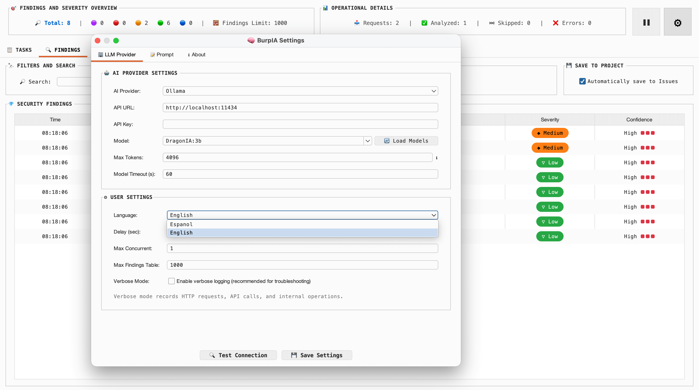

# BurpIA

BurpIA is a Burp Suite extension that analyzes HTTP traffic with LLMs to help you detect potential security findings in less time.

**Current version:** `1.0.0`

Spanish version: [README.md](README.md)

---

## What you get with BurpIA

- **Hybrid AI Analysis:** Automatic passive scanning or manual (via context menu) over real HTTP evidence (`request` + `response`).
- **High-Speed Triage:** Direct sending of findings to Repeater, Intruder, or Scanner from the centralized results table.
- **Smart Findings Management:** Prioritization by severity/confidence with the option to send directly to the Burp Suite project.
- **Deduplication and Load Control:** Queue system with concurrency limits and SHA-256 hashes to avoid redundant re-analysis.
- **Flexible Export:** Support for data export in CSV and JSON formats for external reports.
- **User Experience:** Bilingual interface (Spanish/English) with settings persistence across plugin restarts.

---

## Current status (v1.0.0)

- **Scope-Aware Validation:** Strict `Target Scope` control (Pro/Community) before any analysis to avoid out-of-scope noise.
- **Task Management:** Full workflow control (pause, resume, cancel, retry, and clear tasks).
- **Findings Control:** Optional automatic saving to `Site Map > Issues` or selective manual submission.
- **Smart Deduplication:** SHA-256 hashes with LRU cache and TTL expiration to avoid processing duplicates.
- **High-Performance Static Filter:** Elimination of irrelevant resources via string comparison (without URI parsing overhead).
- **Data Resilience (Safe JSON Repair):** Recovery of corrupted or truncated JSON objects without loss of legitimate data.
- **Log Optimization:** Buffer-based write system to prevent saturation of the Burp Suite API.
- **Passive Capture and Architecture:** Non-intrusive analysis with a refactored structure and decoupled handlers for better maintainability.

---

## Quick Start (3 minutes)

1. Download the `BurpIA-1.0.0.jar` file.
2. Load the extension in Burp Suite:
   - Go to the `Extensions` tab -> `Add`.
   - Select the `BurpIA-1.0.0.jar` file.
3. Configure BurpIA in the plugin tab:
   - Select your **LLM Provider**.
   - Enter the **API Key** (if applicable).
   - Choose the **Model**.
   - Configure the **Interface Language** and **Custom Prompt**.
4. Use the **Test Connection** button to validate the endpoint and model before capturing traffic.

---

## Supported LLM Providers

- **Ollama** (Ideal for locally fine-tuned models).
- **OpenAI** (GPT-4o, GPT-3.5, etc.).
- **Claude** (Anthropic).
- **Gemini** (Google).
- **Z.ai** / **Minimax**.
- **Custom** (Any API compatible with the OpenAI format).

> [!TIP]
> If you plan to use Z.ai or Minimax, here are discounted purchase options:
> - [Z.ai with discount](https://z.ai/subscribe?ic=FXSFEPRECU)
> - [Minimax with discount](https://platform.minimax.io/subscribe/coding-plan?code=GdktCUVh7E&source=link)

---

## How it works

### Passive flow
1. BurpIA intercepts an HTTP response.
2. It checks the **Scope**, applies filters, and performs **deduplication**.
3. The task is queued in the analysis manager.
4. It builds the prompt by injecting the `request` and `response`.
5. It parses the AI response and normalizes the findings.
6. It updates the results table, statistics, and (if enabled) saves to **Issues**.

### Manual flow
1. Select any request in any Burp tab.
2. Right-click -> `Analyze request with BurpIA`.
3. BurpIA analyzes the request and its associated response.
4. The finding appears in the table to be edited, exported, or sent to other tools.

---

## Custom Prompt

BurpIA supports the following tokens to customize analysis:

- `{REQUEST}`: Inserts the normalized HTTP request.
- `{RESPONSE}`: Inserts the HTTP response (if available).
- `{OUTPUT_LANGUAGE}`: Indicates the expected output language for the finding description.

*If you omit these tokens, BurpIA will automatically add a security block (fallback) to maintain minimum context and enforce the configured language.*

---

## Requirements

- **Java 17** or higher.
- **Burp Suite** (Community or Professional).
- Connectivity to the configured AI provider (local or remote).

---

## Best Practices

- Enable **"Auto-save to Issues"** only if you want direct persistence in the Burp project file.
- **Manually validate** each finding before reporting; AI can hallucinate.
- If using cloud providers, review your privacy policy before sending traffic with sensitive data.

---

## Limitations

- May generate false positives; always requires expert human validation.
- If a manual analysis has no associated response, the model will analyze the `request` only.