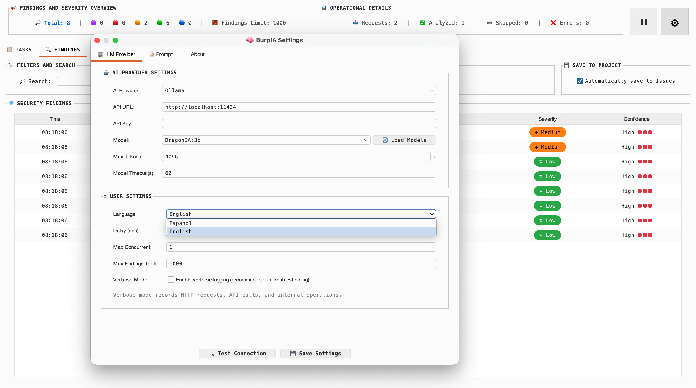
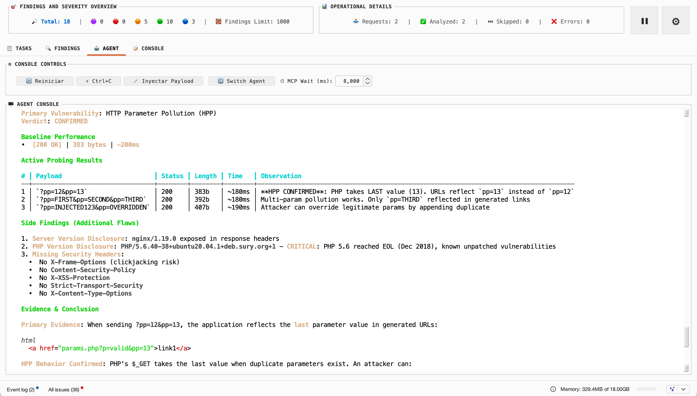
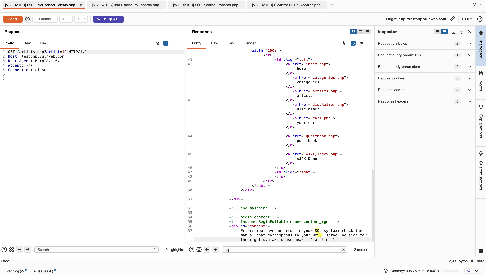

# BurpIA

  

BurpIA is a Burp Suite extension that analyzes HTTP traffic with LLMs to help you detect potential security findings in less time.

**Current version:** `1.5.0`

Spanish version: [README.md](README.md)

---

## Key Screenshots

### 1) BurpIA Overview (EN)

- Displays the central dashboard with finding counts by severity and operational status.
- Helps quickly locate the main tabs: tasks, findings, agent, and console.
- Clarifies the end-to-end workflow, from detection to manual validation.

### 2) Agent-Based Manual Validation

- Demonstrates the agentic dynamic testing flow over real HTTP traffic.
- Shows the baseline, executed payloads, observations, and side findings in a single output.
- Speeds up the technical evidence review before reporting a finding.

### 3) Validated Findings in Repeater

- Shows how BurpIA keeps traceable manual validations in Repeater tabs.
- Speeds up triage by preserving reproducible request/response evidence per validated case.
- Improves collaboration by leaving clear, review-ready technical proof.

---

## What you get with BurpIA

- **Hybrid AI Analysis:** Automatic passive scanning or manual (via context menu) over real HTTP evidence (`request` + `response`).
- **Flow Analysis:** Capability to analyze multiple related requests as a single contextual flow.
- **High-Speed Triage:** Direct sending of findings to Repeater, Intruder, or Scanner from the centralized results table.
- **Smart Findings Management:** Prioritization by severity/confidence with the option to send directly to the Burp Suite project.
- **Adaptive Interface:** Native support for Burp's **Dark/Light** modes, responsive window, and font customization.
- **Deduplication and Load Control:** Queue system with concurrency limits and SHA-256 hashes to avoid redundant re-analysis.
- **Flexible Export:** Support for data export in CSV and JSON formats for external reports.
- **User Experience:** Bilingual interface (Spanish/English) with repetitive alert suppression and settings persistence.

## Agent guides

- Factory Droid: [ES](AGENTE-DROID-ES.md) | [EN](AGENT-DROID-EN.md)
- Claude Code: [ES](AGENTE-CLAUDE-ES.md) | [EN](AGENT-CLAUDE-EN.md)
- Gemini CLI: [ES](AGENTE-GEMINI-ES.md) | [EN](AGENT-GEMINI-EN.md)
- OpenCode: [ES](AGENTE-OPENCODE-ES.md) | [EN](AGENT-OPENCODE-EN.md)

---

## Current status (v1.5.0)

BurpIA is updated to `v1.5.0`.
See the change summary in **Version history**.

---

## Version history

### v1.5.0 (current)

- **Contextual flow analysis:** analyzes multiple HTTP requests as a complete flow in a single LLM query, now including both requests and responses.
- **Improved context menu:** new options "🔍 Analyze this flow" and "🤖 Send this flow to agent" in proxy history menu.
- **Send flow to agent:** sends the complete flow (requests + responses) to the CLI agent with specialized prompt for deep validation.
- **Visual and UI improvements:** native support for Burp Suite Dark and Light themes, responsive settings window, and font customization (standard and mono).
- **Alert management:** new option to suppress confirmation messages ("Do not show this message again") to streamline workflow.
- **New Agents:** official integration with **Gemini CLI** and **Open Code**, along with stability improvements for **Claude Code** and **Factory Droid**.
- **New Providers:** optimized support for **Gemini** (Google) and **DeepSeek** models (via Ollama/Custom).
- **I18n Improvements:** complete refinement of Spanish and English translations and technical documentation enhancements.

### v1.0.2

- New multi-provider system: check requests using up to 5 different providers.
- Update notification system.
- User experience improvements.
- Interface customization improvements.
- Performance improvements.

### v1.0.1

- Now with dynamic agentic manual testing using Factory Droid, Claude Code, and the Burp Suite MCP.
- New LLM provider: Moonshot.
- Translation and usability improvements.
- Efficiency and overall performance improvements.

### v1.0.0

- Functional baseline for hybrid analysis, task/finding management, and passive/manual workflow.
- Initial integration with major LLM providers and result export support.

---

## Quick Start (3 minutes)

1. Download the `BurpIA-1.5.0.jar` file.
2. Load the extension in Burp Suite:
   - Go to the `Extensions` tab -> `Add`.
   - Select the `BurpIA-1.5.0.jar` file.
3. Configure BurpIA in the plugin tab:
   - Select your **LLM Provider**.
   - Enter the **API Key** (if applicable).
   - Choose the **Model**.
   - Configure the **Interface Language** and **Custom Prompt**.
4. Use the **Test Connection** button to validate the endpoint and model before capturing traffic.

---

## Supported LLM Providers

- **Ollama** (Local models: Gemma 3, DeepSeek v3, Phi-4, Llama 3.3, etc.).
- **OpenAI** (o1 models, GPT-4o, etc.).
- **Claude** (Anthropic: Sonnet 3.5/3.6, Opus).
- **Gemini** (Google: 1.5 Pro/Flash with native support).
- **DeepSeek** (Via Ollama or OpenAI-compatible providers).
- **Moonshot (Kimi)** (k2.5 and previous models).
- **Z.ai** / **Minimax**.
- **Custom** (Up to 3 custom profiles for any OpenAI-compatible API).

> [!TIP]
> If you plan to use Z.ai or Minimax, here are discounted purchase options:
> - [Z.ai with discount](https://z.ai/subscribe?ic=FXSFEPRECU)
> - [Minimax with discount](https://platform.minimax.io/subscribe/coding-plan?code=GdktCUVh7E&source=link)

---

## How it works

### Passive flow
1. BurpIA intercepts an HTTP response.
2. It checks the **Scope**, applies filters, and performs **deduplication**.
3. The task is queued in the analysis manager.
4. It builds the prompt by injecting the `request` and `response`.
5. It parses the AI response and normalizes the findings.
6. It updates the results table, statistics, and (if enabled) saves to **Issues**.

### Manual flow
1. Select any request in any Burp tab.
2. Right-click -> `Analyze request with BurpIA`.
3. BurpIA analyzes the request and its associated response.
4. The finding appears in the table to be edited, exported, or sent to other tools.

---

## Custom Prompt

BurpIA supports the following tokens to customize analysis:

- `{REQUEST}`: Inserts the normalized HTTP request.
- `{RESPONSE}`: Inserts the HTTP response (if available).
- `{OUTPUT_LANGUAGE}`: Indicates the expected output language for the finding description.

*If you omit these tokens, BurpIA will automatically add a security block (fallback) to maintain minimum context and enforce the configured language.*

---

## Requirements

- **Java 17** or higher.
- **Burp Suite** (Community or Professional).
- Connectivity to the configured AI provider (local or remote).

---

## Best Practices

- Enable **"Auto-save to Issues"** only if you want direct persistence in the Burp project file.
- **Manually validate** each finding before reporting; AI can hallucinate.
- If using cloud providers, review your privacy policy before sending traffic with sensitive data.

---

## Limitations

- May generate false positives; always requires expert human validation.
- If a manual analysis has no associated response, the model will analyze the `{REQUEST}` only.
