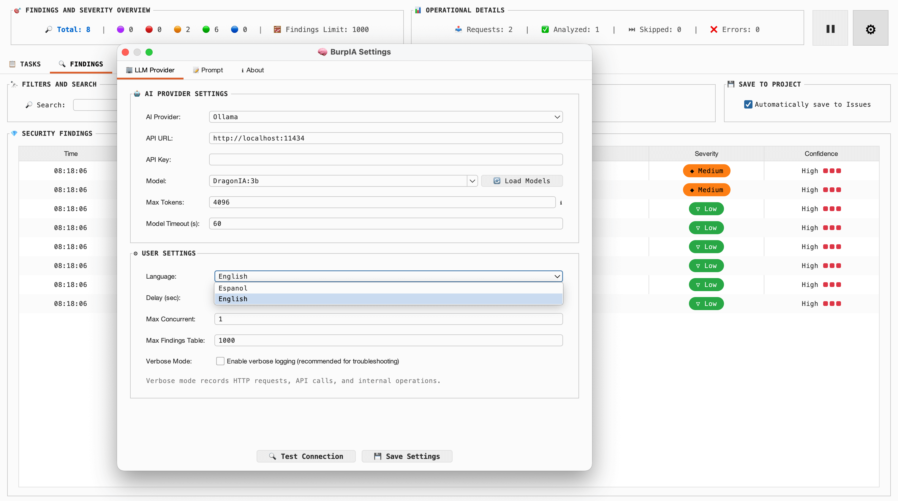
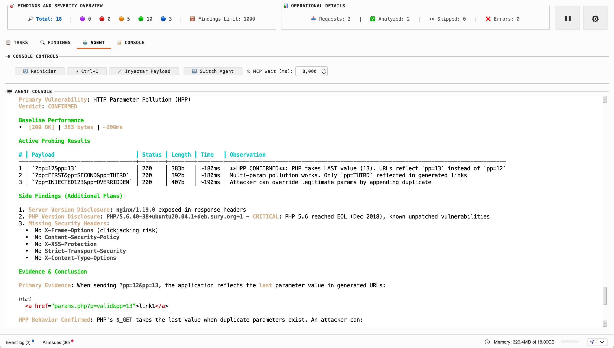

# BurpIA

  

BurpIA is a Burp Suite extension that analyzes HTTP traffic with LLMs to help you detect potential security findings in less time.

**Current version:** `1.7.0`

Spanish version: [README.md](README.md)

---

## Key Screenshots

### 1) BurpIA Overview (EN)

- Displays the central dashboard with finding counts by severity and operational status.
- Helps quickly locate the main tabs: tasks, findings, agent, and console.
- Clarifies the end-to-end workflow, from detection to manual validation.

### 2) Agent-Based Manual Validation

- Demonstrates the agentic dynamic testing flow over real HTTP traffic.
- Shows the baseline, executed payloads, observations, and side findings in a single output.
- Speeds up the technical evidence review before reporting a finding.

### 3) Validated Findings in Repeater

- Shows how BurpIA keeps traceable manual validations in Repeater tabs.
- Speeds up triage by preserving reproducible request/response evidence per validated case.
- Improves collaboration by leaving clear, review-ready technical proof.

---

## What you get with BurpIA

- **Hybrid AI Analysis:** Automatic passive scanning or manual (via context menu) over real HTTP evidence (`request` + `response`).
- **Flow Analysis:** Contextual analysis of 2 to 4 related requests as a single flow, with direct submission to the CLI agent for deep validation.
- **High-Speed Triage:** Direct sending of findings to **Burp Repeater** from the centralized results table.
- **Smart Findings Management:** Prioritization by severity/confidence with text and severity filters, and the option to send directly to the Burp Suite project.
- **Adaptive Interface:** Native support for Burp's **Dark/Light** modes, responsive window, and font customization (standard and mono).
- **Deduplication and Load Control:** Queue system with configurable concurrency limit (1–10), SHA-256 hashes, 15-min TTL and 10,000-entry LRU to avoid redundant re-analysis; automatic static resource filtering.
- **Flexible Export:** Support for exporting findings in CSV and JSON formats for external reports.
- **User Experience:** Bilingual interface (Spanish/English), per-alert opt-out with persistence ("Don't show this again"), and persistent filters and settings.
- **Advanced Context Menu:** Individual analysis options ("Analyze request with BurpIA"), flow analysis ("🔍 Analyze this flow" for 2–4 requests), and direct CLI agent integration ("🤖 Analyze with {Agent}").

## Agent guides

- Factory Droid: [ES](AGENTE-DROID-ES.md) | [EN](AGENT-DROID-EN.md)
- Claude Code: [ES](AGENTE-CLAUDE-ES.md) | [EN](AGENT-CLAUDE-EN.md)
- Gemini CLI: [ES](AGENTE-GEMINI-ES.md) | [EN](AGENT-GEMINI-EN.md)
- OpenCode: [ES](AGENTE-OPENCODE-ES.md) | [EN](AGENT-OPENCODE-EN.md)
- Grok Build: [ES](AGENTE-GROK-ES.md) | [EN](AGENT-GROK-EN.md)

---

## Current status (v1.7.0)

BurpIA is currently at `v1.7.0`.
See the change summary in **Version history**.

---

## Version history

### v1.7.0

**New LLM providers:**
- **DeepSeek** (`deepseek-v4-flash`, `deepseek-v4-pro`, plus legacy chat/reasoner — OpenAI-compatible API with `Authorization: Bearer`).
- **xAI Grok** (`grok-4.3`, `grok-4`, `grok-3`, `grok-2` / `grok-2-vision` — OpenAI-compatible API).
- **Ollama Cloud** (cloud models at `https://ollama.com` with `Authorization: Bearer`, HTTPS required).
- **Sakana Fugu** (`fugu`, `fugu-ultra` — OpenAI-compatible API).

**New CLI agent:**
- **Grok CLI** (`GROK_BUILD`): integration of xAI's Grok agent into the Agents tab, with automatic binary detection at `~/.grok/bin/grok` (Unix) or `%USERPROFILE%\.grok\bin\grok.exe` (Windows). Permissions are controlled via `~/.grok/config.toml` (`permission_mode = "always-approve"`).

### v1.5.0

- **Contextual flow analysis:** analyzes multiple HTTP requests as a complete flow in a single LLM query, now including both requests and responses.
- **Send flow to agent:** sends the complete flow (requests + responses) to the CLI agent with specialized prompt for deep validation.
- **Flow correlation in context menu:** enables joint analysis of up to 4 requests from Proxy History using the new "🔍 Analyze this flow" and "🤖 Send this flow to agent" options, optimizing the detection of state-based or logic flow vulnerabilities.
- **Visual and UI improvements:** native support for Burp Suite Dark and Light themes, responsive settings window, and font customization (standard and mono).
- **Alert management:** new option to suppress confirmation messages ("Do not show this message again") to streamline workflow.
- **New Agents:** official integration with **Gemini CLI** and **Open Code**, along with stability improvements for **Claude Code** and **Factory Droid**.
- **New Providers and Flexibility:** expanded catalog of supported providers and the ability to configure up to 3 independent custom profiles (OpenAI-API compatible) for maximum versatility.
- **I18n Improvements:** complete refinement of Spanish and English translations and technical documentation enhancements.

### v1.0.2

- **Multi-provider System:** ability to query requests using multiple configured providers simultaneously.
- **Update Notifications:** new alert engine for available version updates.
- **User Experience:** optimizations for navigation and general usability.
- **Interface Customization:** enhancements to visual environment settings.
- **Performance:** optimized response and loading times.

### v1.0.1

- **Dynamic Agentic Testing:** integration with Factory Droid, Claude Code, and Burp Suite MCP for advanced manual validation.
- **New Provider:** official support for Moonshot AI.
- **Internationalization:** refinement of translations and multi-language usability.
- **General Efficiency:** structural improvements in plugin performance.

### v1.0.0

- **Hybrid Analysis:** functional baseline for passive and manual HTTP traffic scanning.
- **Task Management:** centralized findings orchestration and analysis queue.
- **LLM Integration:** initial compatibility with major language model providers.
- **Data Export:** support for saving results in standard formats.

---

## Quick Start (3 minutes)

1. Download the `BurpIA-1.7.0.jar` file.
2. Load the extension in Burp Suite:
   - Go to the `Extensions` tab -> `Add`.
   - Select the `BurpIA-1.7.0.jar` file.
3. Configure BurpIA in the plugin tab:
   - Select your **LLM Provider**.
   - Enter the **API Key** (if applicable).
   - Choose the **Model**.
   - Configure the **Interface Language** and **Custom Prompt**.
4. Use the **Test Connection** button to validate the endpoint and model before capturing traffic.

---

## Supported LLM Providers

- **Ollama** (Local models: Gemma 3, DeepSeek v3, Phi-4, Llama 3.3, etc.).
- **Ollama Cloud** (Cloud models at `https://ollama.com` — requires API key).
- **OpenAI** (o1 models, GPT-4o, etc.).
- **Claude** (Anthropic: Sonnet 3.5/3.6, Opus).
- **Gemini** (Google: 1.5 Pro/Flash with native support).
- **Moonshot (Kimi)** (k2.5 and previous models).
- **Z.ai** / **Minimax**.
- **DeepSeek** (v4-flash, v4-pro models — OpenAI-compatible API).
- **xAI Grok** (grok-4.3, grok-4 models — OpenAI-compatible API).
- **Sakana Fugu** (fugu, fugu-ultra models — OpenAI-compatible API).
- **LM Studio** (Local LLM server, OpenAI-compatible).
- **Custom** (Up to 3 custom profiles for any OpenAI-compatible API).

> **Note:** DeepSeek can be used through Ollama or via a Custom profile with the OpenAI-compatible API.
> **Note on Grok:** **xAI Grok** is supported both as an LLM provider (OpenAI-compatible API) and as an autonomous CLI agent — see [AGENT-GROK-EN.md](AGENT-GROK-EN.md) for the Grok CLI setup with Burp MCP.

> [!TIP]
> If you plan to use Z.ai or Minimax, here are discounted purchase options:
> - [Z.ai with discount](https://z.ai/subscribe?ic=FXSFEPRECU)
> - [Minimax with discount](https://platform.minimax.io/subscribe/coding-plan?code=GdktCUVh7E&source=link)

---

## How it works

### Passive flow
1. BurpIA intercepts an HTTP response.
2. It checks the **Scope**, applies filters, and performs **deduplication**.
3. The task is queued in the analysis manager.
4. It builds the prompt by injecting the `request` and `response`.
5. It parses the AI response and normalizes the findings.
6. It updates the results table, statistics, and (if enabled) saves to **Issues**.

### Manual flow
1. Select one or more requests (2–4 for flow analysis) in any Burp tab.
2. Right-click:
   - **1 request:** `Analyze request with BurpIA` or `🤖 Analyze with {Agent}`.
   - **2–4 requests:** `🔍 Analyze this flow` or `🤖 Analyze this flow with {Agent}`.
3. BurpIA analyzes the request/flow and its associated responses.
4. The finding appears in the table to be edited, exported, or sent to Repeater.

---

## Custom Prompt

BurpIA supports the following tokens to customize analysis:

### Individual analysis
- `{REQUEST}`: Inserts the normalized HTTP request.
- `{RESPONSE}`: Inserts the HTTP response (if available).
- `{OUTPUT_LANGUAGE}`: Indicates the expected output language for the finding description.

### Flow analysis (2–4 requests)
- `{REQUEST_1}`, `{REQUEST_2}`, ... : Inserts the Nth request in the flow.
- `{RESPONSE_1}`, `{RESPONSE_2}`, ... : Inserts the Nth response in the flow.
- `{REQUEST}`: Inserts all requests in the flow concatenated.
- `{OUTPUT_LANGUAGE}`: Output language (same as individual analysis).

*If you omit these tokens, BurpIA will automatically add a security block (fallback) to maintain minimum context and enforce the configured language.*

---

## Requirements

- **Java 17** or higher.
- **Burp Suite** (Community or Professional).
- Connectivity to the configured AI provider (local or remote).

---

## Best Practices

- Enable **"Auto-save to Issues"** only if you want direct persistence in the Burp project file.
- **Manually validate** each finding before reporting; AI can hallucinate.
- If using cloud providers, review your privacy policy before sending traffic with sensitive data.

---

## Limitations

- May generate false positives; always requires expert human validation.
- If a manual analysis has no associated response, the model will analyze the `{REQUEST}` only.
