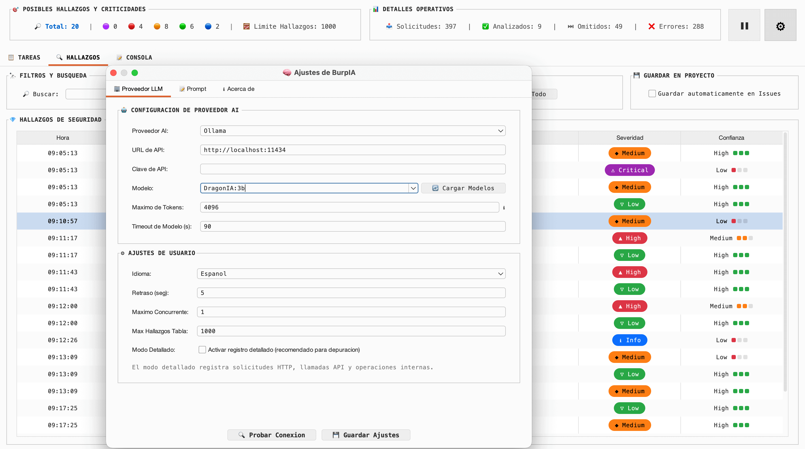

# BurpIA

BurpIA es una extensión para Burp Suite que analiza tráfico HTTP con LLMs para ayudarte a detectar hallazgos potenciales de seguridad en menos tiempo.

**Versión actual:** `1.0.0`

English version: [README.en.md](README.en.md)

---

## Qué obtienes con BurpIA

- **Análisis Híbrido con IA:** Escaneo pasivo automático o manual (vía menú contextual) sobre evidencia HTTP real (`request` + `response`).
- **Triage de Alta Velocidad:** Envío directo de hallazgos a Repeater, Intruder o Scanner desde la tabla centralizada de resultados.
- **Gestión Inteligente de Hallazgos:** Priorización por severidad/confianza con opción de envío directo al proyecto de Burp Suite.
- **Deduplicación y Control de Carga:** Sistema de colas con límite de concurrencia y hashes SHA-256 para evitar re-análisis redundantes.
- **Exportación Flexible:** Soporte para volcado de datos en formatos CSV y JSON para informes externos.
- **Experiencia de Usuario:** Interfaz bilingüe (Español/Inglés) con persistencia de ajustes entre reinicios del plugin.

---

## Estado actual (v1.0.0)

- **Validación Scope-Aware:** Control estricto del `Target Scope` (Pro/Community) antes de cualquier análisis para evitar ruido fuera de objetivo.
- **Gestión de Tareas:** Control total del flujo de trabajo (pausar, reanudar, cancelar, reintentar y limpiar tareas).
- **Control de Hallazgos:** Guardado automático opcional en `Site Map > Issues` o envío manual selectivo.
- **Deduplicación Inteligente:** Uso de hashes SHA-256 con caché LRU y expiración TTL para evitar procesar duplicados.
- **Filtro Estático de Alto Rendimiento:** Eliminación de recursos irrelevantes mediante comparación de strings (sin el overhead de URI parsing).
- **Resiliencia de Datos (Safe JSON Repair):** Recuperación de objetos JSON corruptos o truncados sin pérdida de datos legítimos.
- **Optimización de Logs:** Sistema de escritura por buffer para prevenir la saturación de la API de Burp Suite.
- **Captura Pasiva y Arquitectura:** Análisis no intrusivo con una estructura refactorizada y manejadores desacoplados para mayor mantenibilidad.

---

## Inicio rápido (3 minutos)

1. Descarga el archivo `BurpIA-1.0.0.jar`.
2. Carga la extensión en Burp Suite:
    - Ve a la pestaña `Extensions` -> `Add`.
    - Selecciona el archivo `BurpIA-1.0.0.jar`.
3. Configura BurpIA en la pestaña del plugin:
    - Selecciona tu **Proveedor LLM**.
    - Ingresa la **API Key** (si aplica).
    - Elige el **Modelo**.
    - Configura el **Idioma de interfaz** y el **Prompt personalizado**.
4. Usa el botón **Probar Conexión** para validar el endpoint y el modelo antes de capturar tráfico.

---

## Proveedores LLM soportados

- **Ollama** (Ideal para modelos locales fine-tuneados).
- **OpenAI** (GPT-4o, GPT-3.5, etc.).
- **Claude** (Anthropic).
- **Gemini** (Google).
- **Z.ai** / **Minimax**.
- **Custom** (Cualquier API compatible con el formato de OpenAI).

> [!TIP]
> Si vas a usar Z.ai o Minimax, aquí tienes opciones de compra con descuento:
> - [Z.ai con descuento](https://z.ai/subscribe?ic=FXSFEPRECU)
> - [Minimax con descuento](https://platform.minimax.io/subscribe/coding-plan?code=GdktCUVh7E&source=link)

---

## Cómo funciona

### Flujo pasivo
1. BurpIA intercepta una respuesta HTTP.
2. Verifica el **Scope**, aplica filtros y realiza la **deduplicación**.
3. Encola la tarea en el gestor de análisis.
4. Construye el prompt inyectando la `request` y `response`.
5. Parsea la respuesta de la IA y normaliza los hallazgos.
6. Actualiza la tabla de resultados, estadísticas y (si está activo) guarda en **Issues**.

### Flujo manual
1. Seleccionas una solicitud cualquiera en cualquier pestaña de Burp.
2. Clic derecho -> `Analizar solicitud con BurpIA`.
3. BurpIA analiza la solicitud y su respuesta asociada.
4. El hallazgo aparece en la tabla para ser editado, exportado o enviado a otras herramientas.

---

## Prompt personalizado

BurpIA soporta los siguientes tokens para personalizar el análisis:

- `{REQUEST}`: Inserta la solicitud HTTP normalizada.
- `{RESPONSE}`: Inserta la respuesta HTTP (si existe).
- `{OUTPUT_LANGUAGE}`: Indica el idioma de salida esperado para la descripción del hallazgo.

*Si omites estos tokens, BurpIA fallará al generar el prompt.*

---

## Requisitos

- **Java 17** o superior.
- **Burp Suite** (Community o Professional).
- Conectividad al proveedor de IA configurado (local o remoto).

---

## Buenas prácticas

- Activa **"Guardar automáticamente en Issues"** solo si deseas persistencia directa en el archivo de proyecto de Burp.
- **Valida manualmente** cada hallazgo antes de reportarlo; la IA puede alucinar.
- Si usas proveedores en la nube, revisa tu política de privacidad antes de enviar tráfico con datos sensibles.

---

## Limitaciones

- Puede generar falsos positivos; siempre requiere validación humana experta.
- Si un análisis manual no tiene una respuesta asociada, el modelo analizará únicamente la solicitud (`request`).