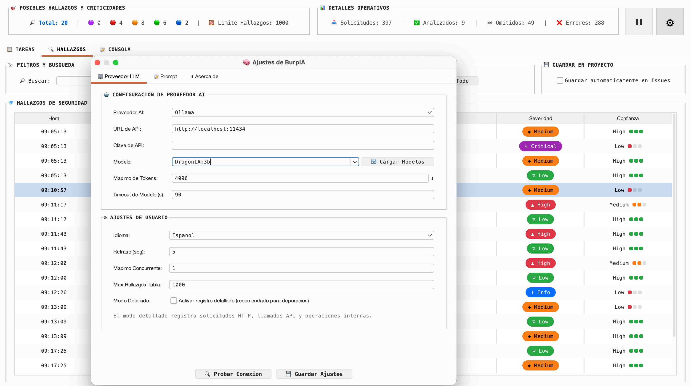
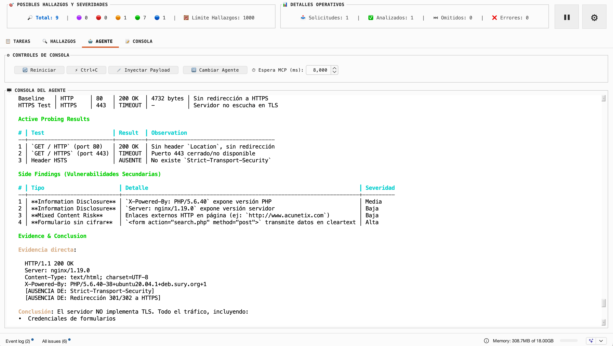
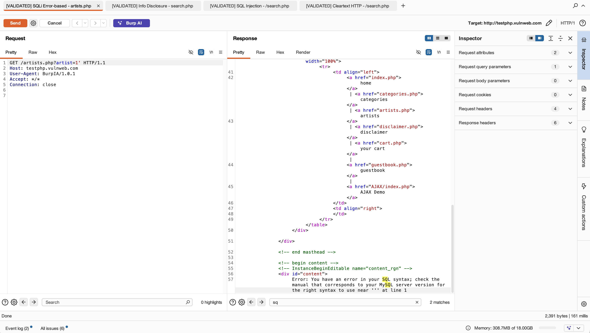

# BurpIA

  

BurpIA es una extensión para Burp Suite que analiza tráfico HTTP con LLMs para ayudarte a detectar hallazgos potenciales de seguridad en menos tiempo.

**Versión actual:** `1.7.0`

English version: [README.en.md](README.en.md)

---

## Capturas clave

### 1) Vista general de BurpIA (ES)

- Muestra el tablero central con el recuento de hallazgos por severidad y estado operativo.
- Facilita la localización de las pestañas principales: tareas, hallazgos, agente y consola.
- Ilustra el flujo de trabajo integral, desde la detección hasta la validación manual.

### 2) Validación manual con agente

- Presenta el flujo dinámico basado en agentes sobre tráfico HTTP real.
- Permite visualizar la línea base, los payloads ejecutados, observaciones y hallazgos secundarios en una misma salida.
- Agiliza la revisión de la evidencia técnica antes de reportar un hallazgo.

### 3) Hallazgos validados en Repeater

- Demuestra cómo BurpIA deja trazabilidad de validaciones manuales en pestañas de Repeater.
- Acelera el triage al mantener requests/responses reproducibles para cada caso validado.
- Mejora la colaboración al dejar evidencia directa lista para revisión del equipo.

---

## Qué obtienes con BurpIA

- **Análisis Híbrido con IA:** Escaneo pasivo automático o manual (vía menú contextual) sobre evidencia HTTP real (`request` + `response`).
- **Análisis de Flujos:** Análisis contextual de 2 a 4 peticiones relacionadas como un único flujo, con envío directo al agente CLI para validación profunda.
- **Triage de Alta Velocidad:** Envío directo de hallazgos a **Burp Repeater** desde la tabla centralizada de resultados.
- **Gestión Inteligente de Hallazgos:** Priorización por severidad/confianza con filtros por texto y severidad, y opción de envío directo al proyecto de Burp Suite.
- **Interfaz Adaptativa:** Soporte nativo para modo **Dark/Light** de Burp, ventana responsive y personalización de tipografías (estándar y mono).
- **Deduplicación y Control de Carga:** Sistema de colas con límite de concurrencia configurable (1–10), hashes SHA-256, TTL de 15 min y LRU de 10 000 entradas para evitar re-análisis redundantes; filtrado automático de recursos estáticos.
- **Exportación Flexible:** Soporte para volcado de hallazgos en formatos CSV y JSON para informes externos.
- **Experiencia de Usuario:** Interfaz bilingüe (Español/Inglés), supresión individual de alertas con persistencia ("No volver a mostrar"), y persistencia de filtros y ajustes.
- **Menú Contextual Avanzado:** Opciones de análisis individual ("Analizar solicitud con BurpIA"), análisis de flujo ("🔍 Analizar este flujo" para 2–4 peticiones), e integración directa con agentes CLI ("🤖 Analizar con {Agente}").

## Guías de agentes

- Factory Droid: [ES](AGENTE-DROID-ES.md) | [EN](AGENT-DROID-EN.md)
- Claude Code: [ES](AGENTE-CLAUDE-ES.md) | [EN](AGENT-CLAUDE-EN.md)
- Gemini CLI: [ES](AGENTE-GEMINI-ES.md) | [EN](AGENT-GEMINI-EN.md)
- OpenCode: [ES](AGENTE-OPENCODE-ES.md) | [EN](AGENT-OPENCODE-EN.md)
- Grok Build: [ES](AGENTE-GROK-ES.md) | [EN](AGENT-GROK-EN.md)

---

## Estado actual (v1.7.0)

BurpIA está actualmente en `v1.7.0`.
Consulta el resumen de cambios en **Historial de versiones**.

---

## Historial de versiones

### v1.7.0

**Nuevos proveedores LLM:**
- **DeepSeek** (modelos `deepseek-v4-flash`, `deepseek-v4-pro` y legacy chat/reasoner — API compatible con OpenAI, `Authorization: Bearer`).
- **xAI Grok** (modelos `grok-4.3`, `grok-4`, `grok-3`, `grok-2`/`grok-2-vision` — API compatible con OpenAI).
- **Ollama Cloud** (modelos cloud en `https://ollama.com` con `Authorization: Bearer`, HTTPS obligatorio).
- **Sakana Fugu** (modelos `fugu`, `fugu-ultra` — API compatible con OpenAI).

**Nuevo agente CLI:**
- **Grok CLI** (`GROK_BUILD`): integración del agente Grok de xAI en la pestaña Agentes, con detección automática de binario en `~/.grok/bin/grok` (Unix) o `%USERPROFILE%\.grok\bin\grok.exe` (Windows). Permisos controlados vía `~/.grok/config.toml` (`permission_mode = "always-approve"`).

### v1.5.0

- **Análisis de flujo contextual:** analiza múltiples peticiones HTTP como un flujo completo en una sola consulta al LLM, incluyendo ahora tanto peticiones como respuestas.
- **Envío de flujo al agente:** envía el flujo completo (peticiones + respuestas) al agente CLI con prompt especializado para validación profunda.
- **Correlación de flujos en menú contextual:** permite seleccionar y analizar de forma conjunta hasta 4 peticiones del Proxy History mediante las nuevas opciones "🔍 Analizar este flujo" y "🤖 Enviar este flujo al agente", optimizando la detección de vulnerabilidades de estado o flujos lógicos.
- **Mejoras visuales y UI:** soporte nativo para los temas Dark y Light de Burp Suite, ventana de ajustes responsive y personalización de fuentes (estándar y mono).
- **Gestión de alertas:** nueva opción para omitir mensajes de confirmación ("No volver a mostrar") para agilizar el flujo de trabajo.
- **Nuevos Agentes:** integración oficial con **Gemini CLI** y **Open Code**, junto a mejoras de estabilidad en **Claude Code** y **Factory Droid**.
- **Nuevos Proveedores y Flexibilidad:** mayor catálogo de proveedores soportados y capacidad de configurar hasta 3 perfiles personalizados independientes (compatibles con la API de OpenAI) para máxima versatilidad.
- **Mejoras de I18n:** refinamiento completo de las traducciones en español e inglés y mejoras en la documentación técnica.

### v1.0.2

- **Sistema Multi-proveedor:** capacidad de consultar peticiones utilizando múltiples proveedores configurados simultáneamente.
- **Notificaciones de Actualización:** nuevo motor de aviso para nuevas versiones disponibles.
- **Experiencia de Usuario:** optimizaciones en la navegación y usabilidad general.
- **Personalización de Interfaz:** mejoras en la customización del entorno visual.
- **Rendimiento:** optimización de tiempos de respuesta y carga.

### v1.0.1

- **Pruebas Agénticas Dinámicas:** integración con Factory Droid, Claude Code y el MCP de Burp Suite para validación manual avanzada.
- **Nuevo Proveedor:** soporte oficial para Moonshot AI.
- **Interacionalización:** refinamiento de traducciones y usabilidad multilingüe.
- **Eficiencia General:** mejoras estructurales en el rendimiento del plugin.

### v1.0.0

- **Análisis Híbrido:** base funcional para escaneo pasivo y manual de tráfico HTTP.
- **Gestión de Tareas:** orquestación centralizada de hallazgos y cola de análisis.
- **Integración LLM:** compatibilidad inicial con los principales proveedores de modelos de lenguaje.
- **Exportación:** soporte para descarga de resultados en formatos estándar.

---

## Inicio rápido (3 minutos)

1. Descarga el archivo `BurpIA-1.7.0.jar`.
2. Carga la extensión en Burp Suite:
    - Ve a la pestaña `Extensions` -> `Add`.
    - Selecciona el archivo `BurpIA-1.7.0.jar`.
3. Configura BurpIA en la pestaña del plugin:
    - Selecciona tu **Proveedor LLM**.
    - Ingresa la **API Key** (si aplica).
    - Elige el **Modelo**.
    - Configura el **Idioma de interfaz** y el **Prompt personalizado**.
4. Usa el botón **Probar Conexión** para validar el endpoint y el modelo antes de capturar tráfico.

---

## Proveedores LLM soportados

- **Ollama** (Modelos locales: Gemma 3, DeepSeek v3, Phi-4, Llama 3.3, etc.).
- **Ollama Cloud** (Modelos cloud en `https://ollama.com` — requiere API key).
- **OpenAI** (Modelos o1, GPT-4o, etc.).
- **Claude** (Anthropic: Sonnet 3.5/3.6, Opus).
- **Gemini** (Google: 1.5 Pro/Flash con soporte nativo).
- **Moonshot (Kimi)** (Modelos k2.5 y anteriores).
- **Z.ai** / **Minimax**.
- **DeepSeek** (Modelos v4-flash, v4-pro — API compatible con OpenAI).
- **xAI Grok** (Modelos grok-4.3, grok-4 — API compatible con OpenAI).
- **Sakana Fugu** (Modelos fugu, fugu-ultra — API compatible con OpenAI).
- **LM Studio** (Servidor LLM local compatible con OpenAI).
- **Custom** (Hasta 3 perfiles personalizados para cualquier API compatible con OpenAI).

> **Nota:** DeepSeek se puede utilizar a través de Ollama o mediante un perfil Custom con la API compatible con OpenAI.
> **Nota sobre Grok:** **xAI Grok** está soportado tanto como proveedor LLM (API compatible con OpenAI) como agente CLI autónomo — ver [AGENTE-GROK-ES.md](AGENTE-GROK-ES.md) para la configuración del CLI de Grok con Burp MCP.

> [!TIP]
> Si vas a usar Z.ai o Minimax, aquí tienes opciones de compra con descuento:
> - [Z.ai con descuento](https://z.ai/subscribe?ic=FXSFEPRECU)
> - [Minimax con descuento](https://platform.minimax.io/subscribe/coding-plan?code=GdktCUVh7E&source=link)

---

## Cómo funciona

### Flujo pasivo
1. BurpIA intercepta una respuesta HTTP.
2. Verifica el **Scope**, aplica filtros y realiza la **deduplicación**.
3. Encola la tarea en el gestor de análisis.
4. Construye el prompt inyectando la `request` y `response`.
5. Parsea la respuesta de la IA y normaliza los hallazgos.
6. Actualiza la tabla de resultados, estadísticas y (si está activo) guarda en **Issues**.

### Flujo manual
1. Selecciona una o varias solicitudes (2–4 para flujo) en cualquier pestaña de Burp.
2. Clic derecho:
   - **1 solicitud:** `Analizar solicitud con BurpIA` o `🤖 Analizar con {Agente}`.
   - **2–4 solicitudes:** `🔍 Analizar este flujo` o `🤖 Analizar este flujo con {Agente}`.
3. BurpIA analiza la solicitud/flujo y sus respuestas asociadas.
4. El hallazgo aparece en la tabla para ser editado, exportado o enviado a Repeater.

---

## Prompt personalizado

BurpIA soporta los siguientes tokens para personalizar el análisis:

### Análisis individual
- `{REQUEST}`: Inserta la solicitud HTTP normalizada.
- `{RESPONSE}`: Inserta la respuesta HTTP (si existe).
- `{OUTPUT_LANGUAGE}`: Indica el idioma de salida esperado para la descripción del hallazgo.

### Análisis de flujo (2–4 peticiones)
- `{REQUEST_1}`, `{REQUEST_2}`, ... : Inserta la N-ésima solicitud del flujo.
- `{RESPONSE_1}`, `{RESPONSE_2}`, ... : Inserta la N-ésima respuesta del flujo.
- `{REQUEST}`: Inserta todas las solicitudes del flujo concatenadas.
- `{OUTPUT_LANGUAGE}`: Idioma de salida (igual que análisis individual).

*Si omites estos tokens, BurpIA aplicará un bloque de contexto mínimo para mantener consistencia y el idioma de salida configurado.*

---

## Requisitos

- **Java 17** o superior.
- **Burp Suite** (Community o Professional).
- Conectividad al proveedor de IA configurado (local o remoto).

---

## Buenas prácticas

- Activa **"Guardar automáticamente en Issues"** solo si deseas persistencia directa en el archivo de proyecto de Burp.
- **Valida manualmente** cada hallazgo antes de reportarlo; la IA puede alucinar.
- Si usas proveedores en la nube, revisa tu política de privacidad antes de enviar tráfico con datos sensibles.

---

## Limitaciones

- Puede generar falsos positivos; siempre requiere validación humana experta.
- Si un análisis manual no tiene una respuesta asociada, el modelo analizará únicamente la solicitud (`{REQUEST}`).
